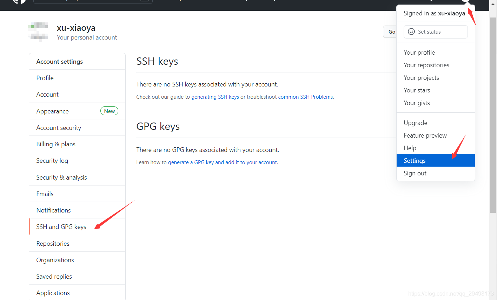
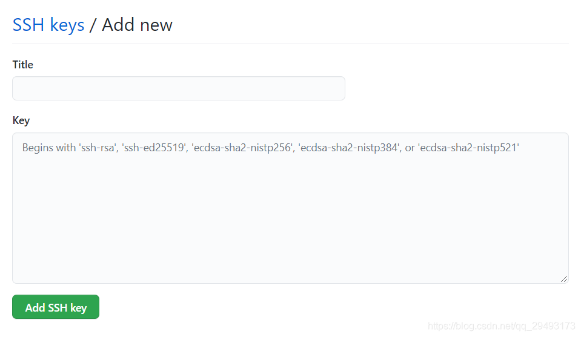

## git 初始化设置

- 用户名和邮箱要与 GitHub 上一致

~~~ git
$ git config --global user.name "<用户名>"
$ git config --global user.email "<电子邮件>"
~~~

- 查看设置

~~~ git
git config --list
~~~

## 与 gitHub 建立连接

- 创建 SSH Key

~~~ git
# 输入
$ ssh-keygen -t rsa -C "youxiang@qq.com"
# 按几次回车到命令结束
~~~

- 找到文件夹 `用户\.ssh`

- 在 GitHub 上填写 SSH Key

 

- title 随意，key 填写 id_rsa.pub 的全部内容

- 验证

~~~ git
ssh -T git@github.com
~~~

## 提交代码到 GitHub

 ~~~ git
 # 新建本地库
 $ git init
 # 加入到暂存区
 $ git add <文件或目录>
 # 添加到本地库
 $ git commit -m "版本备注"
 # 关联远程仓库
 $ git remote add origin "仓库地址"
 # 推送到远程仓库(远程仓库如果为空)
 $ git push -u origin master 
 # 推送到远程仓库(远程仓库不是空的)
 $ git push origin master
 ~~~

## 克隆远程仓库

~~~ git
git clone "仓库目录"
~~~

