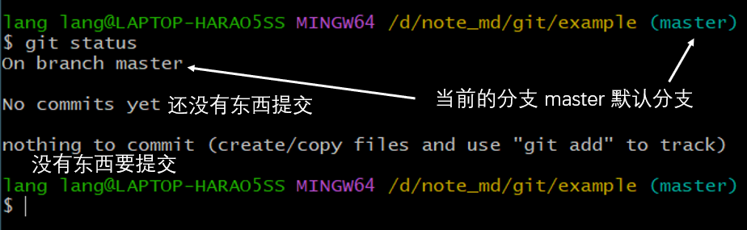
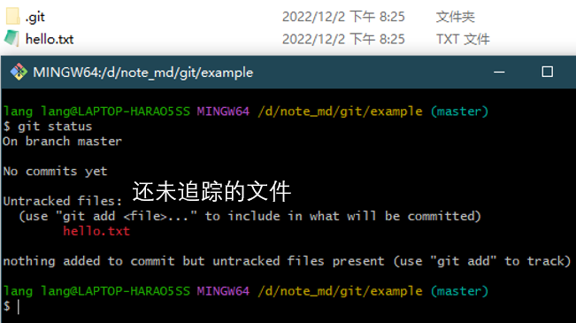
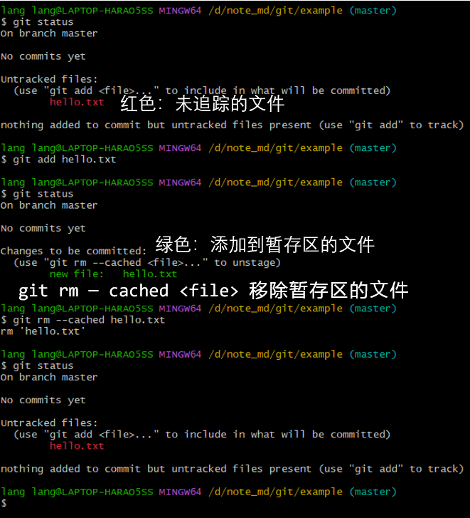
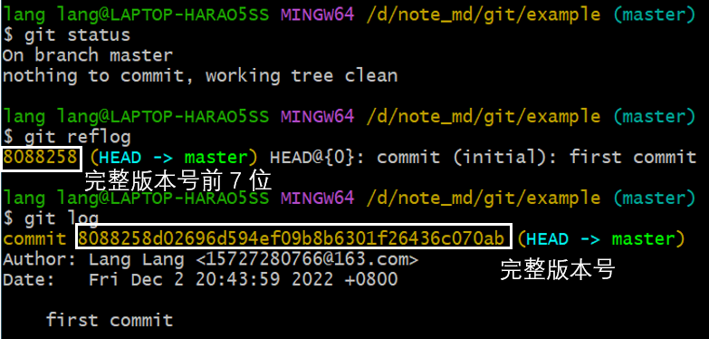
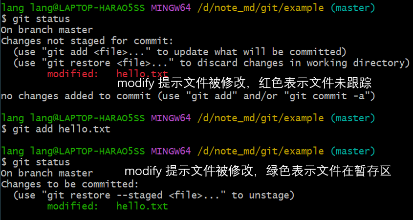
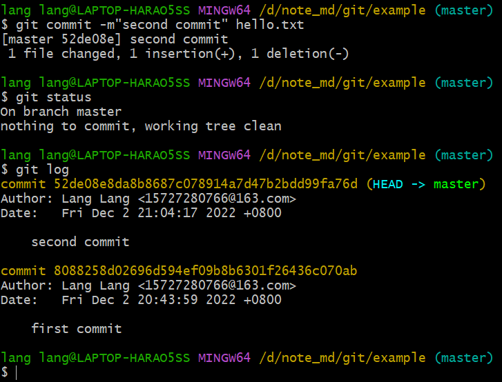
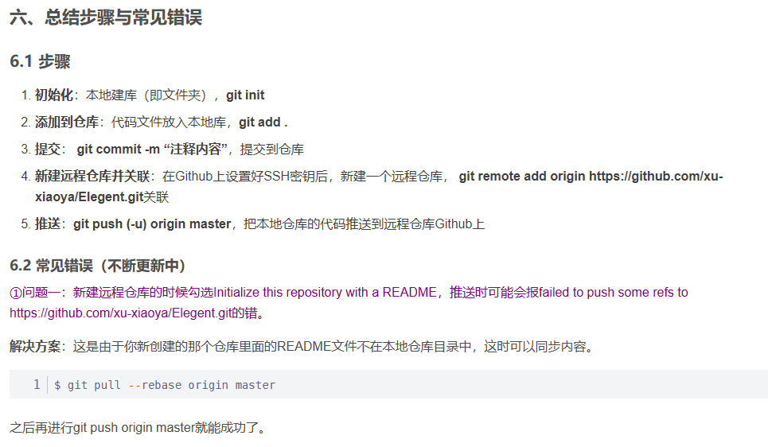

[git 简明指南 (runoob.com)](https://www.runoob.com/manual/git-guide/)

## Git 常用命令

| 命令名称                               | 作用                             |
| -------------------------------------- | -------------------------------- |
| git config --global user.name "用户名" | 设置用户签名                     |
| git config --global user.email "邮箱"  | 设置用户签名                     |
| git init                               | 初始化本地库                     |
| git status                             | 查看本地库状态                   |
| git add 文件名                         | 添加到暂存区                     |
| git commit -m"日志信息" 文件名         | 提交到本地库                     |
| git reflog                             | 查看当前结点及父节点以及操作日志 |
| git log                                | 查看当前结点及父节点的详细描述   |
| git reset --hard 版本号                | 回去以前的版本（会变更工作区）   |

- 双击 tab 键代码补全

- **首次安装 git 必须提交用户签名，否则无法提交代码。**
  - 签名的作用用于区分不同操作者的身份；
  - 这里设置的用户签名和将来登录 GitHub (或其他代码托管中心)的账号没有任何关系。

- git init 会在当前目录下新建一个隐藏文件夹 `.git`，里面就是新建好的空的 git 仓库。
- **git brash 支持 linux 命令** 

### git status

### git add 添加到暂存区

### git commit -m "版本备注"	\<file>

- **git reflog 查看版本信息**
- **git log 查看版本详细信息**

### 修改文件

### 版本穿梭 git reset --hard \<版本号>

- **git reset --hard 会直接影响工作区。**
- [SegmentFault 思否](https://segmentfault.com/)
- [git reset --hard 回滚以后 以后怎么再回去？ - SegmentFault 思否](https://segmentfault.com/q/1010000002984945)

~~~cmd
lang lang@LAPTOP-HARAO5SS MINGW64 /d/note_md/git/example (master)
$ git log
commit 87b6dfa488a3d355bd3d6f9496af4835dba28d7f (HEAD -> master)
Author: Lang Lang <15727280766@163.com>
Date:   Fri Dec 2 21:16:58 2022 +0800

    third commit

commit 52de08e8da8b8687c078914a7d47b2bdd99fa76d
Author: Lang Lang <15727280766@163.com>
Date:   Fri Dec 2 21:04:17 2022 +0800

    second commit

commit 8088258d02696d594ef09b8b6301f26436c070ab
Author: Lang Lang <15727280766@163.com>
Date:   Fri Dec 2 20:43:59 2022 +0800

    first commit

lang lang@LAPTOP-HARAO5SS MINGW64 /d/note_md/git/example (master)
$ git reflog
87b6dfa (HEAD -> master) HEAD@{0}: commit: third commit
52de08e HEAD@{1}: commit: second commit
8088258 HEAD@{2}: commit (initial): first commit

lang lang@LAPTOP-HARAO5SS MINGW64 /d/note_md/git/example (master)
$ git reset --hard 87b6dfa
HEAD is now at 87b6dfa third commit

lang lang@LAPTOP-HARAO5SS MINGW64 /d/note_md/git/example (master)
$ git reflog
87b6dfa (HEAD -> master) HEAD@{0}: reset: moving to 87b6dfa
87b6dfa (HEAD -> master) HEAD@{1}: commit: third commit
52de08e HEAD@{2}: commit: second commit
8088258 HEAD@{3}: commit (initial): first commit

lang lang@LAPTOP-HARAO5SS MINGW64 /d/note_md/git/example (master)
$ git reset --hard 52de08e
HEAD is now at 52de08e second commit

lang lang@LAPTOP-HARAO5SS MINGW64 /d/note_md/git/example (master)
$ git reflog
52de08e (HEAD -> master) HEAD@{0}: reset: moving to 52de08e
87b6dfa HEAD@{1}: reset: moving to 87b6dfa
87b6dfa HEAD@{2}: commit: third commit
52de08e (HEAD -> master) HEAD@{3}: commit: second commit
8088258 HEAD@{4}: commit (initial): first commit

lang lang@LAPTOP-HARAO5SS MINGW64 /d/note_md/git/example (master)
$ git log
commit 52de08e8da8b8687c078914a7d47b2bdd99fa76d (HEAD -> master)
Author: Lang Lang <15727280766@163.com>
Date:   Fri Dec 2 21:04:17 2022 +0800

    second commit

commit 8088258d02696d594ef09b8b6301f26436c070ab
Author: Lang Lang <15727280766@163.com>
Date:   Fri Dec 2 20:43:59 2022 +0800

    first commit

lang lang@LAPTOP-HARAO5SS MINGW64 /d/note_md/git/example (master)
$ git reset --hard 8088258
HEAD is now at 8088258 first commit

lang lang@LAPTOP-HARAO5SS MINGW64 /d/note_md/git/example (master)
$ git reflog
8088258 (HEAD -> master) HEAD@{0}: reset: moving to 8088258
52de08e HEAD@{1}: reset: moving to 52de08e
87b6dfa HEAD@{2}: reset: moving to 87b6dfa
87b6dfa HEAD@{3}: commit: third commit
52de08e HEAD@{4}: commit: second commit
8088258 (HEAD -> master) HEAD@{5}: commit (initial): first commit

lang lang@LAPTOP-HARAO5SS MINGW64 /d/note_md/git/example (master)
$ git log
commit 8088258d02696d594ef09b8b6301f26436c070ab (HEAD -> master)
Author: Lang Lang <15727280766@163.com>
Date:   Fri Dec 2 20:43:59 2022 +0800

    first commit

lang lang@LAPTOP-HARAO5SS MINGW64 /d/note_md/git/example (master)
$ git reset --hard 87b6dfa
HEAD is now at 87b6dfa third commit

lang lang@LAPTOP-HARAO5SS MINGW64 /d/note_md/git/example (master)
$ git log
commit 87b6dfa488a3d355bd3d6f9496af4835dba28d7f (HEAD -> master)
Author: Lang Lang <15727280766@163.com>
Date:   Fri Dec 2 21:16:58 2022 +0800

    third commit

commit 52de08e8da8b8687c078914a7d47b2bdd99fa76d
Author: Lang Lang <15727280766@163.com>
Date:   Fri Dec 2 21:04:17 2022 +0800

    second commit

commit 8088258d02696d594ef09b8b6301f26436c070ab
Author: Lang Lang <15727280766@163.com>
Date:   Fri Dec 2 20:43:59 2022 +0800

    first commit

lang lang@LAPTOP-HARAO5SS MINGW64 /d/note_md/git/example (master)
$

~~~

## 分支操作

> **branch** /bræntʃ/ [C] 分支

| 命令                               | 作用                                                 |
| ---------------------------------- | ---------------------------------------------------- |
| git branch 分支名                  | 创建分支                                             |
| git branch -v                      | 查看分支                                             |
| git checkout 分支名                | 切换分支                                             |
| git branch -f 分支名 哈希/相对引用 | 强制修改分支位置                                     |
| git checkout 哈希/相对引用         | 分离 HEAD 指向指定版本                               |
| git checkout -b 分支名             | 创建新分支(如果不存在)并切换到该分支                 |
| git merge 分支名                   | 把指定的分支合并到当前分支上                         |
| git log --all                      | 查看所有结点（不会显示 reset --hard 结点之后的结点） |

### 查看分支 git branch -v 

~~~cmd
lang lang@LAPTOP-HARAO5SS MINGW64 /d/note_md/git/example (master)
$ git branch -v
* master 87b6dfa third commit （*代表当前所在的分区）
~~~

### 创建分支 git branch \<分支名>

~~~cmd
lang lang@LAPTOP-HARAO5SS MINGW64 /d/note_md/git/example (master)
$ git branch hot-fix （创建一个hot-fix热修分支，用于紧急修复）

lang lang@LAPTOP-HARAO5SS MINGW64 /d/note_md/git/example (master)
$ git branch
  hot-fix
* master

lang lang@LAPTOP-HARAO5SS MINGW64 /d/note_md/git/example (master)
$ git branch -v
  hot-fix 87b6dfa third commit
* master  87b6dfa third commit

~~~

### 切换分支 git checkout \<分支名>

~~~cmd
lang lang@LAPTOP-HARAO5SS MINGW64 /d/note_md/git/example (master)
$ git checkout hot-fix
Switched to branch 'hot-fix'

lang lang@LAPTOP-HARAO5SS MINGW64 /d/note_md/git/example (hot-fix)
$ git branch -v
* hot-fix 87b6dfa third commit
  master  87b6dfa third commit
~~~

#### 在分支下修改了工作区文件

~~~cmd
lang lang@LAPTOP-HARAO5SS MINGW64 /d/note_md/git/example (hot-fix)
$ git status
On branch hot-fix
Changes not staged for commit:
  (use "git add <file>..." to update what will be committed)
  (use "git restore <file>..." to discard changes in working directory)
        modified:   hello.txt

no changes added to commit (use "git add" and/or "git commit -a")

lang lang@LAPTOP-HARAO5SS MINGW64 /d/note_md/git/example (hot-fix)
$ git add hello.txt

lang lang@LAPTOP-HARAO5SS MINGW64 /d/note_md/git/example (hot-fix)
$ git commit -m"hot-fix first commit" hello.txt
[hot-fix 8033988] hot-fix first commit
 1 file changed, 2 insertions(+), 1 deletion(-)

lang lang@LAPTOP-HARAO5SS MINGW64 /d/note_md/git/example (hot-fix)
$ git reflog
8033988 (HEAD -> hot-fix) HEAD@{0}: commit: hot-fix first commit
18b3a9d (master) HEAD@{1}: checkout: moving from master to hot-fix
18b3a9d (master) HEAD@{2}: commit: master third commit
5b263b2 HEAD@{3}: commit: master second commit
22cabe4 HEAD@{4}: commit (initial): master first commit

lang lang@LAPTOP-HARAO5SS MINGW64 /d/note_md/git/example (hot-fix)
$ cat hello.txt
hello
world
！
2333

lang lang@LAPTOP-HARAO5SS MINGW64 /d/note_md/git/example (hot-fix)
$ git checkout master
Switched to branch 'master'

lang lang@LAPTOP-HARAO5SS MINGW64 /d/note_md/git/example (master)
$ cat hello.txt
hello
world
！
~~~

### 合并分支 git merge \<分支名>

- **将指定分支合并到当前分支，正常合并**

~~~cmd
lang lang@LAPTOP-HARAO5SS MINGW64 /d/note_md/git/example (hot-fix)
$ cat hello.txt
hello
world
！
2333
lang lang@LAPTOP-HARAO5SS MINGW64 /d/note_md/git/example (hot-fix)
$ git checkout master
Switched to branch 'master'

lang lang@LAPTOP-HARAO5SS MINGW64 /d/note_md/git/example (master)
$ cat hello.txt
hello
world
！
lang lang@LAPTOP-HARAO5SS MINGW64 /d/note_md/git/example (master)
$ git merge hot-fix
Updating 18b3a9d..8033988
Fast-forward
 hello.txt | 3 ++-
 1 file changed, 2 insertions(+), 1 deletion(-)

lang lang@LAPTOP-HARAO5SS MINGW64 /d/note_md/git/example (master)
$ cat hello.txt
hello
world
！
2333
lang lang@LAPTOP-HARAO5SS MINGW64 /d/note_md/git/example (master)
$ git reflog
8033988 (HEAD -> master, hot-fix) HEAD@{0}: merge hot-fix: Fast-forward
18b3a9d HEAD@{1}: checkout: moving from hot-fix to master
8033988 (HEAD -> master, hot-fix) HEAD@{2}: commit: hot-fix first commit
18b3a9d HEAD@{3}: checkout: moving from master to hot-fix
18b3a9d HEAD@{4}: commit: master third commit
5b263b2 HEAD@{5}: commit: master second commit
22cabe4 HEAD@{6}: commit (initial): master first commit

lang lang@LAPTOP-HARAO5SS MINGW64 /d/note_md/git/example (master)
$ git log
commit 803398874292cc9021b5022d40ba899302fdb95d (HEAD -> master, hot-fix)
Author: Lang Lang <15727280766@163.com>
Date:   Sat Dec 3 11:01:34 2022 +0800

    hot-fix first commit

commit 18b3a9d7799b5837169c96c45723858b56e15720
Author: Lang Lang <15727280766@163.com>
Date:   Sat Dec 3 10:58:48 2022 +0800

    master third commit

commit 5b263b2f1c9e24fa1b8d1e16d07dd5c5cea495ba
Author: Lang Lang <15727280766@163.com>
Date:   Sat Dec 3 10:57:32 2022 +0800

    master second commit

commit 22cabe4f1c14c68eb5ef8277f2c2e9049ddadc78
Author: Lang Lang <15727280766@163.com>
Date:   Sat Dec 3 10:56:06 2022 +0800

    master first commit

~~~

- **冲突合并**

**冲突产生的原因：** 合并分支时，两个分支**在同一文件的同一位置有两套完全不同的修改**。Git 无法替我们决定使用哪一个。必须**人为决定**新代码内容。

- 

~~~cmd
lang lang@LAPTOP-HARAO5SS MINGW64 /d/note_md/git/example (master)
$ git merge bugFix
Auto-merging hello.txt
CONFLICT (content): Merge conflict in hello.txt
Automatic merge failed; fix conflicts and then commit the result.

lang lang@LAPTOP-HARAO5SS MINGW64 /d/note_md/git/example (master|MERGING)
$ vim hello.txt

lang lang@LAPTOP-HARAO5SS MINGW64 /d/note_md/git/example (master|MERGING)
$ git status
On branch master
You have unmerged paths.
  (fix conflicts and run "git commit")
  (use "git merge --abort" to abort the merge)

Unmerged paths:
  (use "git add <file>..." to mark resolution)
        both modified:   hello.txt

no changes added to commit (use "git add" and/or "git commit -a")

lang lang@LAPTOP-HARAO5SS MINGW64 /d/note_md/git/example (master|MERGING)
$ git add hello.txt

lang lang@LAPTOP-HARAO5SS MINGW64 /d/note_md/git/example (master|MERGING)
$ git commit hello.txt
fatal: cannot do a partial commit during a merge.

lang lang@LAPTOP-HARAO5SS MINGW64 /d/note_md/git/example (master|MERGING)
$ git commit 
[master e8825ff] Merge branch 'bugFix'

lang lang@LAPTOP-HARAO5SS MINGW64 /d/note_md/git/example (master)
$ git log
commit e8825ffc108e9f4ecc0775e8fbd35eb7248f778f (HEAD -> master)
Merge: 6e5050d e17a2b3
Author: Lang Lang <15727280766@163.com>
Date:   Sun Dec 4 16:32:18 2022 +0800

    Merge branch 'bugFix'

commit 6e5050d8949649e2c68ffaee59cbd5b07a7fade2
Author: Lang Lang <15727280766@163.com>
Date:   Sun Dec 4 16:26:05 2022 +0800

    V4

commit e17a2b3d03b513727b94cf658bfecbedd2137b0c (bugFix)
Author: Lang Lang <15727280766@163.com>
Date:   Sun Dec 4 16:22:47 2022 +0800

    V3

commit f0a1046f82eeac5f9a87dfdb992fe1b75035a38e
Author: Lang Lang <15727280766@163.com>
Date:   Sun Dec 4 16:03:04 2022 +0800

    V2

commit 3c90efa2a8b38f1c14d5584d22abd7aeeac816ac
Author: Lang Lang <15727280766@163.com>
Date:   Sun Dec 4 16:01:20 2022 +0800

    V1

~~~

## git GitHub

[Github——git本地仓库建立与远程连接（最详细清晰版本！附简化步骤与常见错误）_git 本地建立仓库_你脸上有BUG的博客-CSDN博客](https://blog.csdn.net/qq_29493173/article/details/113094143)

## 示例

~~~ git
git init
git add README.md
git commit -m "first commit"
git remote add origin https://github.com/用户名/仓库名.git
git push -u origin master
~~~

~~~ git
# 检查与远程库连接是否正常
$ ssh -T git@github.com
# 添加到暂存区
$ git add hello.txt
# 提交到本地库
$ git commit -m "版本备注" hello.txt
# 推送到远程仓库
$ git push origin master
~~~

